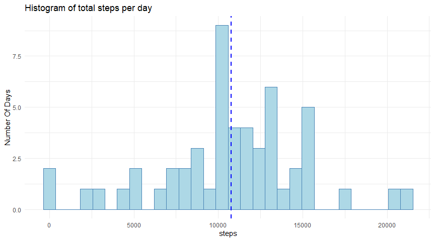
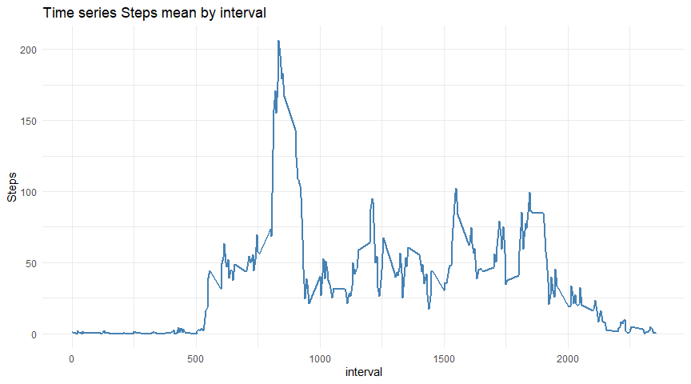
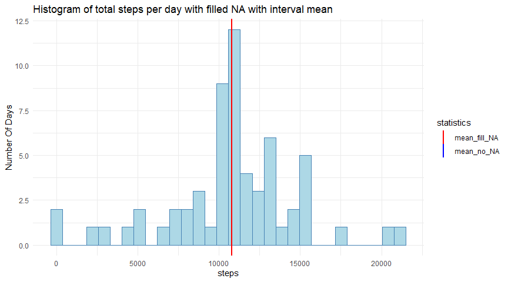
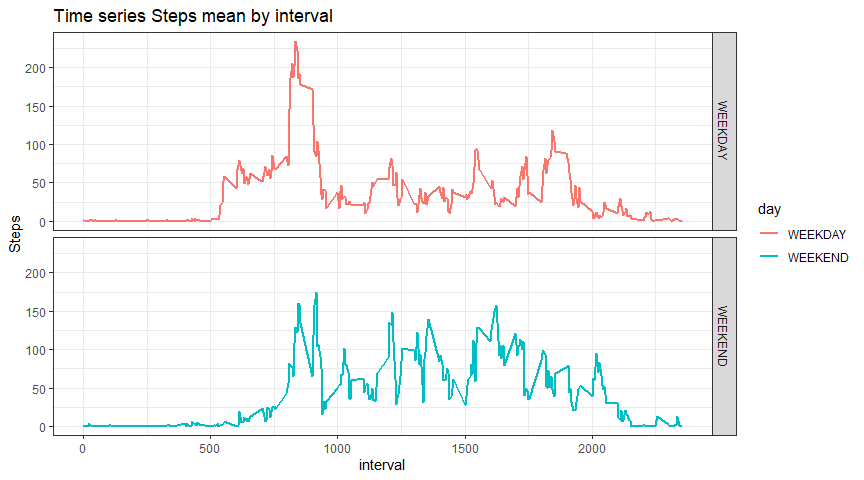

# JHU Coursera Course 5: Reproducible Research: Peer Assessment 1
This assignment makes use of data from a personal activity monitoring device. This device collects data at 5 minute intervals through out the day. The data consists of two months of data from an anonymous individual collected during the months of October and November, 2012 and include the number of steps taken in 5 minute intervals each day.

The data for this assignment can be downloaded from the course web site:

Dataset: Activity monitoring data [ZIPFILE](https://d396qusza40orc.cloudfront.net/repdata%2Fdata%2Factivity.zip)
The variables included in this dataset are:

 * steps: Number of steps taking in a 5-minute interval (missing values are coded as NA
 * date: The date on which the measurement was taken in YYYY-MM-DD format
 * interval: Identifier for the 5-minute interval in which measurement was taken


## Loading and preprocessing the data
Load the data from local directory and preprocessing data transforming data in a data format.

### 1. Code for reading in the dataset and/or processing the data

```r
############################################################################################################

library(knitr)

library(dplyr)
library(ggplot2)
library(kableExtra)

activity.orig <- read.table(unzip("activity.zip", files ="activity.csv", list = FALSE), sep=",", header = TRUE, na.strings = "NA")

activity.orig <- activity.orig %>% mutate(date = as.Date(as.character(date), format("%Y-%m-%d")))
```


## What is mean total number of steps taken per day?
To find the mean of total number of steps per day first of all we remove NA rows, than with dplyr aggregate the data on the date and create an histogram with ggplot2.
Then in the summary table are visible the mean and the median of the dataset.

### 2. Histogram of the total number of steps taken each day

```r
############################################################################################################

#For this part of the assignment, you can ignore the missing values in the dataset.
 
activity <- na.omit(activity.orig)

#1. Calculate the total number of steps taken per day

activity.tot <- activity %>% group_by(date) %>% summarise(steps = sum(steps))

# 2. Make a histogram of the total number of steps taken each day
g <- ggplot(activity.tot, aes(x=steps)) + 
 geom_histogram(colour = "steelblue", fill = "lightblue")+
        geom_vline(aes(xintercept=mean(steps)),
            color="blue", linetype="dashed", size=1)+
  theme_minimal() + ggtitle("Histogram of total steps per day") +
  xlab("steps") + ylab("Number Of Days")

print(g)
```

<!-- -->

### 3. Mean and median number of steps taken each day


```r
#3. Calculate and report the mean and median of the total number of steps taken per day
t<- summary(activity.tot$steps)
rep <- as.data.frame(rbind( c(round(t["Mean"],1),round(t["Median"],1)) ))

k <- rep %>% kable( caption = "mean and median of the total number of steps taken per day")%>%
  kable_styling() 
print(k)
```

<table class="table" style="margin-left: auto; margin-right: auto;">
<caption>mean and median of the total number of steps taken per day</caption>
 <thead>
  <tr>
   <th style="text-align:right;"> Mean </th>
   <th style="text-align:right;"> Median </th>
  </tr>
 </thead>
<tbody>
  <tr>
   <td style="text-align:right;"> 10766.2 </td>
   <td style="text-align:right;"> 10765 </td>
  </tr>
</tbody>
</table>


## What is the average daily activity pattern?
To show the daily average time series we aggregate a the mean on the interval, then we plot the data time series with ggplot.
finally we search the interval that has the step value = to max of the series.

### 4. Time series plot of the average number of steps taken

```r
############################################################################################################

#1. Make a time series plot (i.e. \color{red}{\verb|type = "l"|}type = "l") of the 5-minute interval (x-axis) and the average number of steps taken, averaged across all days (y-axis)
activity <- na.omit(activity.orig)
activity.interval.m <- activity %>% group_by(interval) %>% summarise(steps = mean(steps))

g <- ggplot(activity.interval.m, aes(x=interval)) + 
  geom_line(aes(y = steps), colour = "steelblue", size = 0.8)+
  theme_minimal() + ggtitle("Time series Steps mean by interval") +
  xlab("interval") + ylab("Steps")

print(g)
```

<!-- -->

### 5. The 5-minute interval that, on average, contains the maximum number of steps


```r
# 2. Which 5-minute interval, on average across all the days in the dataset, contains the maximum number of steps?
print(paste0("The 5-minute interval that contains the maximum number of steps is: ", activity.interval.m %>% filter(steps==max(steps)) %>% select(interval) %>% pull()))
```

[1] "The 5-minute interval that contains the maximum number of steps is: 835"


## Imputing missing values
We input missig data using the mean of the interval where available.

### 6. Code to describe and show a strategy for imputing missing data

```r
############################################################################################################

#1. Calculate and report the total number of missing values in the dataset (i.e. the total number of rows with NAs)
summary(activity.orig)
```

     steps             date               interval     
 Min.   :  0.00   Min.   :2012-10-01   Min.   :   0.0  
 1st Qu.:  0.00   1st Qu.:2012-10-16   1st Qu.: 588.8  
 Median :  0.00   Median :2012-10-31   Median :1177.5  
 Mean   : 37.38   Mean   :2012-10-31   Mean   :1177.5  
 3rd Qu.: 12.00   3rd Qu.:2012-11-15   3rd Qu.:1766.2  
 Max.   :806.00   Max.   :2012-11-30   Max.   :2355.0  
 NA's   :2304                                          

```r
print(paste0("There are ", sum(is.na(activity.orig)), " Rows with NAs"))
```

[1] "There are 2304 Rows with NAs"

```r
#2.Devise a strategy for filling in all of the missing values in the dataset. The strategy does not need to be sophisticated. For example, you could use the mean/median for that day, or the mean for that 5-minute interval, etc.
#3.Create a new dataset that is equal to the original dataset but with the missing data filled in.
activity.fill.na <- activity.orig %>% group_by(interval) %>% mutate(steps_fill_na = ifelse(is.na(steps), mean(steps,na.rm=TRUE),steps))
```

### 7. Histogram of the total number of steps taken each day after missing values are imputed

```r
#4. Make a histogram of the total number of steps taken each day and Calculate and report the mean and median total number of steps taken per day. Do these values differ from the estimates from the first part of the assignment? What is the impact of imputing missing data on the estimates of the total daily number of steps?
activity.fill.na.tot <- activity.fill.na %>% group_by(date) %>% summarise(steps = sum(steps), steps_fill_na = sum(steps_fill_na,na.rm=TRUE))

g <- ggplot(activity.fill.na.tot) + 
 geom_histogram(aes(x=steps_fill_na), colour = "steelblue", fill = "lightblue")+
   geom_vline(aes(xintercept=mean(steps,na.rm=TRUE),
            color="mean_no_NA"), linetype="dashed", size=1)+
        geom_vline(aes(xintercept=mean(steps_fill_na,na.rm=TRUE),
            color="mean_fill_NA"), size=1)+
  scale_color_manual(name = "statistics", values = c(mean_no_NA = "blue", mean_fill_NA = "red"))+
  theme_minimal() + ggtitle("Histogram of total steps per day with filled NA with interval mean") +
  xlab("steps") + ylab("Number Of Days")

print(g)
```

<!-- -->

We create a dataframe with two variable, one with original data with NAs, the second with filled NA and the create the delta mesure to compare them.

```r
#calculate and report means and delta
activity.fill.na.tot.rep <- activity.fill.na.tot %>% group_by(date) %>% summarise(Daily_Steps = sum(steps), Daily_Step_fill_na = sum(steps_fill_na, na.rm = TRUE ))  %>% ungroup() %>% summarise(Daily_Steps_mean = mean(Daily_Steps, na.rm = TRUE), Daily_Step_fill_na_mean = mean(Daily_Step_fill_na, na.rm = TRUE ), Daily_Steps_median = median(Daily_Steps, na.rm = TRUE), Daily_Step_fill_na_median = median(Daily_Step_fill_na, na.rm = TRUE )) %>% mutate(mean_delta = Daily_Step_fill_na_mean - Daily_Steps_mean, median_delta =  Daily_Step_fill_na_median- Daily_Steps_median)

#Do these values differ from the estimates from the first part of the assignment? What is the impact of imputing missing data on the estimates of the total daily number of steps?


k <- activity.fill.na.tot.rep %>% kable( caption = "impact of imputing missing data on the estimate of the total daily number of steps")%>%
  kable_styling() 
print(k)
```

<table class="table" style="margin-left: auto; margin-right: auto;">
<caption>impact of imputing missing data on the estimate of the total daily number of steps</caption>
 <thead>
  <tr>
   <th style="text-align:right;"> Daily_Steps_mean </th>
   <th style="text-align:right;"> Daily_Step_fill_na_mean </th>
   <th style="text-align:right;"> Daily_Steps_median </th>
   <th style="text-align:right;"> Daily_Step_fill_na_median </th>
   <th style="text-align:right;"> mean_delta </th>
   <th style="text-align:right;"> median_delta </th>
  </tr>
 </thead>
<tbody>
  <tr>
   <td style="text-align:right;"> 10766.19 </td>
   <td style="text-align:right;"> 10766.19 </td>
   <td style="text-align:right;"> 10765 </td>
   <td style="text-align:right;"> 10766.19 </td>
   <td style="text-align:right;"> 0 </td>
   <td style="text-align:right;"> 1.188679 </td>
  </tr>
</tbody>
</table>
Comparing to original dataframe the mean is the same, the median is a little bit higher (checks the delta in the table above).


## Are there differences in activity patterns between weekdays and weekends?
To show the differencebetween weekend and weekdays whe crate a field with a flag based on day of the week; then we plot bot as face grid of ggplot chart.

### 8. Panel plot comparing the average number of steps taken per 5-minute interval across weekdays and weekends

```r
############################################################################################################
 #1. Create a new factor variable in the dataset with two levels – “weekday” and “weekend” indicating whether a given date is a weekday or weekend day.

activity <- na.omit(activity.orig)
activity.interval.weekday <- activity %>% mutate(day = weekdays(date)) %>% mutate(day = ifelse(day %in% c("domenica","sabato"),"WEEKEND","WEEKDAY"))
activity.interval.weekday.m <- activity.interval.weekday %>% group_by(interval,day) %>% summarise(steps = mean(steps))


#2.Make a panel plot containing a time series plot  of the 5-minute interval (x-axis) and the average number of steps taken, averaged across all weekday days or weekend days (y-axis). See the README file in the GitHub repository to see an example of what this plot should look like using simulated data.


g <- ggplot(activity.interval.weekday.m, aes(x=interval)) +
  geom_line(aes(y = steps, color=day), size = 0.8)+
  theme_bw() + ggtitle("Time series Steps mean by interval") +
  xlab("interval") + ylab("Steps")
g <- g + facet_grid(  day ~ .)
print(g)
```

<!-- -->

The to chart shows that during weekday the peak is higher than weekends.
